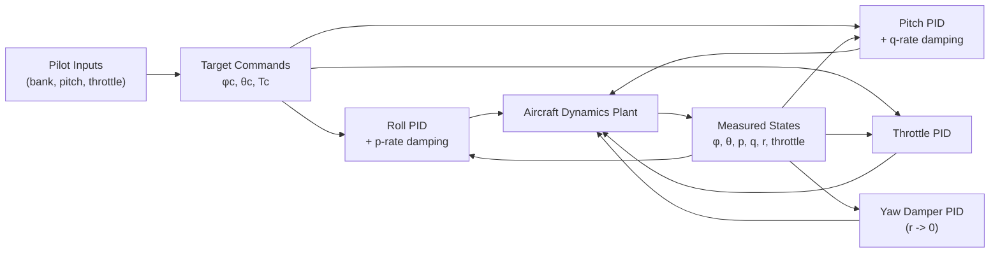

# Fixed-Wing Flight Simulator (Python)

Real-time fixed-wing aircraft simulation with a PID flight-control layer, runway takeoff phase, and interactive pilot inputs.

## Features

- Dynamic model with rigid-body translational + rotational states and throttle actuator dynamics.
- Pilot-commanded bank, pitch, and throttle targets with feedback control.
- Ground rollout and takeoff transition with non-zero friction and liftoff gating.
- Real-time display with horizon, AGL/speed indicators, control/rate traces, and textured terrain cues.

## Quick Start

Run from repository root:

```bash
./run_sim.sh
```

This script bootstraps `.venv`, installs dependencies, and launches the simulator.

Optional:

```bash
./run_sim.sh --setup-only
./run_sim.sh --test
```

On macOS you can also use:

```bash
./run.command
```

## Pilot Controls

- `Left / Right` : command bank-angle target (roll command).
- `Up / Down` : command pitch-angle target (clamped to ±45°).
- `0..9` (top row or numpad): **latched throttle command**.
  - `0` = `0%`
  - `9` = `100%`
  - Command persists after key release.
- `R` : reset to runway start.
- `ESC` : quit.

The UI shows a top-center **Throttle / Power** bar with both commanded and actual throttle percentages.

## Control Method

The simulator uses direct attitude/throttle tracking with PID blocks and phase-dependent pitch shaping:

- Roll channel: bank target $\phi_c$ tracked with aileron command $\delta_a$.
- Pitch channel: pitch target $\theta_c$ tracked with elevator command $\delta_e$, with pitch-target filtering and explicit $q$-rate damping.
- Yaw channel: yaw-rate damping around $r=0$ using rudder $\delta_r$.
- Throttle channel: commanded throttle target tracked through first-order throttle actuator dynamics.

### Controller Architecture (Style Block Diagram)



### Control Law Summary

- Generic PID output:

$$
u = K_p e + K_i \int e\,dt + K_d \hat{\dot{y}}
$$

where $\hat{\dot{y}}$ is filtered derivative-on-measurement feedback (used to reduce derivative kick).

- Additional controller logic in code includes:
  - command clamping: bank/pitch targets are clamped to ±45°,
  - takeoff rotation bias near rotation speed,
  - liftoff latch and low-altitude climb floor logic,
  - performance-mode climb-rate augmentation,
  - command-rate limiting on aileron/elevator to reduce chatter.

## Dynamic System Representation

The model is a nonlinear rigid-body system in NED/body coordinates.

### State Vector

The simulated state includes:

$$
x = [x_N, y_E, z_D, u, v, w, \phi, \theta, \psi, p, q, r, T_a]^\top
$$

- $x_N,y_E,z_D$: inertial position (NED).
- $u,v,w$: body-axis velocity.
- $\phi,\theta,\psi$: Euler roll/pitch/yaw.
- $p,q,r$: body rates.
- $T_a$: actual throttle state.

### Inputs

$$
u_c = [\delta_a, \delta_e, \delta_r, T_c]^\top
$$

- $\delta_a$: aileron
- $\delta_e$: elevator
- $\delta_r$: rudder
- $T_c$: throttle command

### Dynamics (Conceptual Form)

$$
\dot{x} = f(x, u_c, p)
$$

where $p$ is the aircraft parameter set. Forces include:

- aerodynamic lift/drag/side force from dynamic pressure,
- propulsive thrust,
- gravity resolved into body axes,
- ground-friction/rolling effects when on runway.

Moments are computed from nondimensional roll/pitch/yaw derivatives and integrated with Euler rigid-body equations.

### Coordinate Frames and Sign Conventions

- Inertial frame: NED (North-East-Down), with altitude represented as $h = -z_D$.
- Body frame: $x_b$ forward, $y_b$ right wing, $z_b$ down.
- Positive pitch $\theta$ raises nose in the Euler convention used by the simulator.
- Body rates are $(p,q,r)$ about $(x_b,y_b,z_b)$.

### Derived Flight Angles and Dynamic Pressure

The simulator computes at each step:

$$
V = \sqrt{u^2 + v^2 + w^2},\quad
\alpha = \tan^{-1}\left(\frac{w}{u}\right),\quad
\beta = \sin^{-1}\left(\frac{v}{V}\right),\quad
\bar{q} = \frac{1}{2}\rho V^2
$$

with additional effective takeoff-angle shaping near ground through wing incidence and pitch contribution.

### Aerodynamic Coefficient Model

The baseline (pre-stall) coefficient forms are affine in states/inputs (with induced drag nonlinearity):

$$
C_L = C_{L0} + C_{L\alpha}\alpha + C_{Lq}\frac{qc}{2V} + C_{L\delta_e}\delta_e
$$

$$
C_D = C_{D0} + k C_L^2
$$

$$
C_Y = C_{Y\beta}\beta + C_{Y\delta_a}\delta_a + C_{Y\delta_r}\delta_r
$$

$$
C_m = C_{m0} + C_{m\alpha}\alpha + C_{mq}\frac{qc}{2V} + C_{m\delta_e}\delta_e
$$

$$
C_l = C_{l\beta}\beta + C_{lp}\frac{pb}{2V} + C_{lr}\frac{rb}{2V} + C_{l\delta_a}\delta_a + C_{l\delta_r}\delta_r
$$

$$
C_n = C_{n\beta}\beta + C_{np}\frac{pb}{2V} + C_{nr}\frac{rb}{2V} + C_{n\delta_a}\delta_a + C_{n\delta_r}\delta_r
$$

Current code also adds nonlinear post-stall behavior based on effective angle of attack $\alpha_{eff}$:

- lift no longer grows linearly beyond $\alpha_{stall}$,
- drag increases with a quadratic stall term,
- a nose-down pitch moment is added as stall deepens,
- control effectiveness and damping are reduced in deep stall,
- asymmetric roll/yaw coupling terms are added to model wing-drop / incipient spin tendencies.

### Force and Moment Construction

From coefficients:

$$
L = \bar{q}S C_L,\quad D = \bar{q}S C_D,\quad Y = \bar{q}S C_Y
$$

$$
\begin{aligned}
\mathcal{L} &= \bar{q}Sb C_l \\
\mathcal{M} &= \bar{q}Sc C_m \\
\mathcal{N} &= \bar{q}Sb C_n
\end{aligned}
$$

Forces are rotated/combined in body frame with thrust and gravity:

- aerodynamic $(X_a,Y_a,Z_a)$,
- propulsion $X_t = T_{a}\,T_{\max}$,
- gravity components from NED-to-body transformation.

### Translational and Rotational Equations

Translational body equations:

$$
\begin{aligned}
\dot{u} &= rv - qw + \frac{X}{m} \\
\dot{v} &= pw - ru + \frac{Y}{m} \\
\dot{w} &= qu - pv + \frac{Z}{m}
\end{aligned}
$$

Rotational equations (diagonal inertia approximation used by this model):

$$
\begin{aligned}
\dot{p} &= \frac{\mathcal{L} - (I_z-I_y)qr}{I_x} \\
\dot{q} &= \frac{\mathcal{M} - (I_x-I_z)pr}{I_y} \\
\dot{r} &= \frac{\mathcal{N} - (I_y-I_x)pq}{I_z}
\end{aligned}
$$

Euler kinematics are used for attitude propagation, and body velocity is transformed to NED for position update.

### Ground-Contact and Takeoff Transition Model

When on runway ($z_D \ge 0$), the simulator adds:

- rolling friction + rolling resistance,
- wheel-on-ground constraint before liftoff criteria are met,
- takeoff rotation assist and liftoff gating based on speed + lift/pitch conditions.

This gives a continuous rollout \(\to\) rotation \(\to\) climb transition without a mode switch in the state equations.

### Throttle Actuator Dynamics

Throttle is not instantaneous; it follows a first-order actuator:

$$
\dot{T_a} = \frac{T_c - T_a}{\tau_T},\quad T_a \in [0,1]
$$

This introduces realistic lag between pilot command and produced thrust.

### Numerical Integration

The simulator uses fixed-step forward Euler integration at:

$$
\Delta t = \frac{1}{60}\,\text{s}
$$

and applies practical state clamps/constraints (e.g., ground non-penetration, pitch bounds) to keep the interactive model stable.

### Local State-Space Representation and Modal Use

Because the simulator is nonlinear, one global constant $(A,B)$ pair is not valid over the full envelope.
However, local Jacobian linearization around a selected trim state is still meaningful and useful:

$$
\dot{x} = A(\bar{x},\bar{u})\,\Delta x + B(\bar{x},\bar{u})\,\Delta u
$$

with

$$
x=[x_N, y_E, z_D, u, v, w, \phi, \theta, \psi, p, q, r, T_a]^\top,
\quad
u=[\delta_a, \delta_e, \delta_r, T_c]^\top.
$$

This local model captures conventional small-disturbance modes near trim (before deep-stall nonlinearity dominates):

- **Short-period mode (longitudinal, fast):** dominated by $(\alpha, q, \theta)$ states.
  - Primarily shaped by $C_{m\alpha}$ (static pitch stiffness), $C_{mq}$ (pitch-rate damping), and $C_{L\alpha}$ / $C_{Lq}$.
  - In this model, relatively strong negative $C_{mq}$ and negative $C_{m\alpha}$ support a damped short-period response.

- **Long-period / phugoid-like mode (longitudinal, slow):** dominated by speed-altitude energy exchange.
  - Mainly shaped by drag/thrust balance ($C_{D0}$, induced-drag factor $k$, and $T_{max}$), plus gravity coupling through trim pitch.
  - Throttle lag $\tau_T$ affects how quickly propulsion supports or damps this slow mode.

- **Lateral-directional modes:** roll subsidence, Dutch-roll-like coupling, and spiral tendency can be observed around trim.
  - Driven by $C_{l\beta}, C_{lp}, C_{lr}, C_{n\beta}, C_{nr}, C_{np}$ and control derivatives.

In deep stall, the model intentionally becomes strongly nonlinear (lift break, drag rise, control degradation, asymmetric coupling), so linear modal interpretation is only locally valid.

### Aerodynamic/Control Derivative Values (Plugged into Model)

The following coefficients are the active values from the current parameter set used to build the nonlinear dynamics and therefore the linearization above.

| Coefficient | Value |
|---|---:|
| $C_{L0}$ | 0.22 |
| $C_{L\alpha}$ | 5.8 |
| $C_{Lq}$ | 7.0 |
| $C_{L\delta_e}$ | 0.85 |
| $C_{D0}$ | 0.030 |
| $k$ (induced drag) | 0.075 |
| $C_{Y\beta}$ | -0.82 |
| $C_{Y\delta_a}$ | 0.05 |
| $C_{Y\delta_r}$ | 0.16 |
| $C_{m0}$ | 0.00 |
| $C_{m\alpha}$ | -0.85 |
| $C_{mq}$ | -10.5 |
| $C_{m\delta_e}$ | -1.80 |
| $C_{l\beta}$ | -0.12 |
| $C_{lp}$ | -0.55 |
| $C_{lr}$ | 0.10 |
| $C_{l\delta_a}$ | 0.16 |
| $C_{l\delta_r}$ | 0.02 |
| $C_{n\beta}$ | 0.25 |
| $C_{np}$ | -0.02 |
| $C_{nr}$ | -0.32 |
| $C_{n\delta_a}$ | 0.01 |
| $C_{n\delta_r}$ | -0.12 |

Stall/secondary-stall terms currently active:

| Parameter | Value |
|---|---:|
| $\alpha_{stall}$ | 0.28 rad |
| $C_{L,max}$ | 1.35 |
| post-stall $\partial C_L / \partial \alpha$ | -2.4 |
| stall drag quadratic gain | 4.2 |
| post-stall nose-down $C_m$ gain | -3.0 |
| stall autoroll-$\beta$ gain | -0.85 |
| stall autoyaw-$\beta$ gain | 0.55 |
| stall autoroll-$r$ gain | 0.30 |
| stall autoyaw-$p$ gain | -0.20 |
| stall asymmetry bias | 0.02 |

Additional key constants:

| Parameter | Value |
|---|---:|
| $m$ | 1100 kg |
| $S$ | 16.2 m² |
| $b$ | 10.9 m |
| $c$ | 1.5 m |
| $I_x, I_y, I_z$ | 1285, 1825, 2665 kg·m² |
| $\rho$ | 1.225 kg/m³ |
| $T_{max}$ | 6500 N |
| $\tau_T$ | 0.35 s |

If you change any coefficient in `src/flightsim/config.py`, the local Jacobian linearization changes; regenerate it around the desired trim point before controller design work.

## Model Parameters and Their Effects

Representative parameters are defined in `src/flightsim/config.py`.

- `mass_kg`, `i_xx`, `i_yy`, `i_zz`: inertia and translational resistance.
- `wing_area_m2`, `wing_span_m`, `mean_chord_m`: aerodynamic scaling.
- `cl0`, `cl_alpha`, `cl_de`: lift baseline, AoA sensitivity, elevator lift coupling.
- `alpha_stall_rad`, `cl_max`, `cl_post_stall_slope`: stall onset and post-stall lift break behavior.
- `cd_stall_quadratic`: drag rise strength in stall.
- `cm_post_stall_nose_down`: stall break nose-down pitch tendency.
- `cl_stall_autoroll_beta`, `cn_stall_autoyaw_beta`: asymmetric post-stall wing-drop/yaw coupling.
- `cd0`, `k_induced`: drag baseline + induced drag growth.
- `cm_alpha`, `cm_q`, `cm_de`: pitch stiffness, pitch-rate damping, elevator pitch authority.
- `max_thrust_n`: available engine thrust (takeoff/climb authority).
- `runway_friction_coeff`, `rolling_resistance_n`: rollout acceleration and takeoff distance.
- `rotation_speed_m_s`, `liftoff_lift_fraction`, `rotation_pitch_assist_nm`: takeoff transition tuning.

## Visual/Telemetry Elements

- Horizon and aircraft symbol for attitude cueing.
- Left tape: speed.
- Right tape: AGL altitude.
- Throttle/power bar: commanded vs actual throttle.
- Trace panels: control deflections and body rates.
- Terrain texture/trees: perspective and motion cues during rollout/climb.

## Testing

Run all tests:

```bash
./run_sim.sh --test
```

or

```bash
./.venv/bin/python -m pytest -q
```

Current tests cover PID behavior, takeoff/dynamics behavior, and pilot input mapping/latching.

## Scope Note

This is an intentionally lightweight simulation tuned for interactive handling and controller experimentation. It is not a certification-grade aerodynamic or flight-dynamics model.
