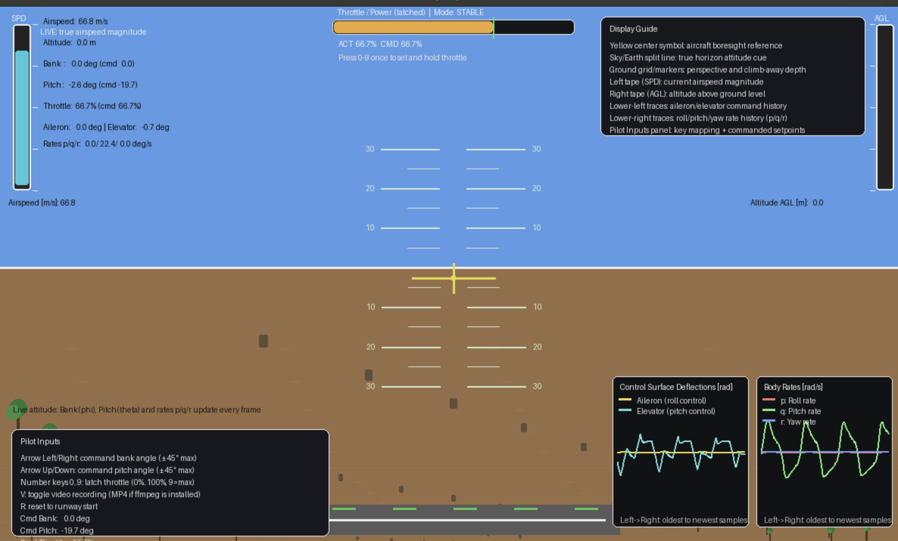
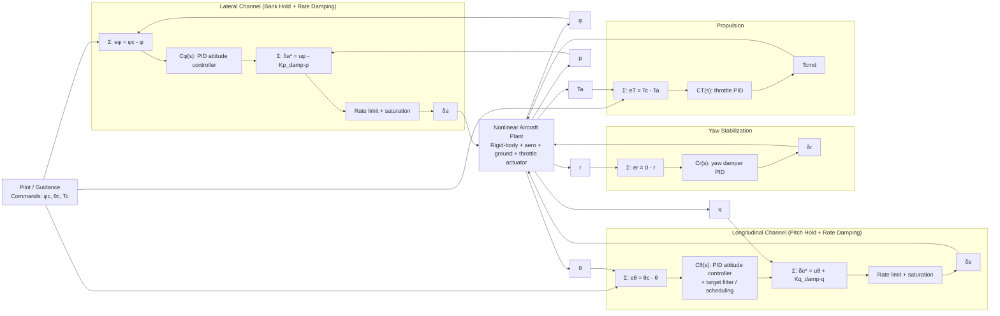

# Fixed-Wing Flight Simulator (Python)

<p align="center">
  
</p>

Real-time fixed-wing aircraft simulation with a PID flight-control layer, runway takeoff phase, and interactive pilot inputs.

## Features

- Dynamic model with rigid-body translational + rotational states and throttle actuator dynamics.
- Pilot-commanded bank, pitch, and throttle targets with feedback control.
- Ground rollout and takeoff transition with non-zero friction and liftoff gating.
- Real-time display with horizon, AGL/speed indicators, control/rate traces, and textured terrain cues.

## Quick Start

Run from repository root:

```bash
./run_sim.sh
```

This script bootstraps `.venv`, installs dependencies, and launches the simulator.

Optional:

```bash
./run_sim.sh --setup-only
./run_sim.sh --test
```

On macOS you can also use:

```bash
./run.command
```

## Pilot Controls

- `Left / Right` : command bank-angle target (roll command).
- `Up / Down` : command pitch-angle target (clamped to ±45°).
- `0..9` (top row or numpad): **latched throttle command**.
  - `0` = `0%`
  - `9` = `100%`
  - Command persists after key release.
- `V` : start/stop flight recording.
  - Saves frames to `recordings/flight_<timestamp>/frames` (PNG, or BMP fallback if PNG is unavailable in local pygame build).
  - If `ffmpeg` is installed, also writes `recordings/flight_<timestamp>/flight.mp4`.
  - On successful MP4 encode, the raw frame folder is removed automatically.
- `M` : toggle controller mode (`STABLE` / `PERFORMANCE`).
- `R` : reset to runway start.
- `ESC` : quit.

The UI shows a top-center **Throttle / Power** bar with both commanded and actual throttle percentages.

## Control Method

The implemented controller is best described as an **attitude-command / attitude-hold (ACAH)** structure with **rate-feedback augmentation** and command shaping:

- Lateral attitude-hold channel: bank target $\phi_c$ tracked with aileron command $\delta_a$.
- Longitudinal attitude-hold channel: pitch target $\theta_c$ tracked with elevator command $\delta_e$.
- Inner-loop-like augmentation: direct body-rate feedback ($p$ and $q$ damping paths) added at control-surface command level.
- Yaw stabilization channel: yaw-rate damper around $r=0$ using rudder $\delta_r$.
- Propulsion channel: throttle command $T_c$ tracked by first-order throttle actuator dynamics.

This is not a strict textbook two-loop cascade (outer attitude loop commanding an explicit inner rate-loop controller state), but it is **cascade-equivalent in effect**: attitude tracking is stabilized by fast rate-feedback augmentation.

### Controller Architecture (Control-Design View)



### Control Law Summary

- Generic PID compensator form:

$$
u = K_p e + K_i \int e\,dt + K_d \hat{\dot{y}}
$$

where $\hat{\dot{y}}$ is filtered derivative-on-measurement feedback (used to reduce derivative kick).

- Implemented channel equations (matching code structure):

$$
\delta_a^* = C_\phi(e_\phi) - K_{p,damp}\,p,
\qquad
e_\phi = \phi_c - \phi
$$

$$
\delta_e^* = C_\theta(e_\theta) + K_{q,damp}\,q,
\qquad
e_\theta = \theta_c - \theta
$$

$$
\delta_r = C_r(0-r),
\qquad
T_{cmd} = C_T(T_c - T_a)
$$

with command filters, mode-dependent pitch shaping (takeoff/liftoff logic), and control-surface rate/saturation limits applied before plant input.

## Dynamic System Representation

The model is a nonlinear rigid-body system in NED/body coordinates.

### State Vector

The simulated state includes:

$$
x = [x_N, y_E, z_D, u, v, w, \phi, \theta, \psi, p, q, r, T_a]^\top
$$

- $x_N,y_E,z_D$: inertial position (NED).
- $u,v,w$: body-axis velocity.
- $\phi,\theta,\psi$: Euler roll/pitch/yaw.
- $p,q,r$: body rates.
- $T_a$: actual throttle state.

### Inputs

$$
u_c = [\delta_a, \delta_e, \delta_r, T_c]^\top
$$

- $\delta_a$: aileron
- $\delta_e$: elevator
- $\delta_r$: rudder
- $T_c$: throttle command

### Dynamics (Conceptual Form)

$$
\dot{x} = f(x, u_c, p)
$$

where $p$ is the aircraft parameter set. Forces include:

- aerodynamic lift/drag/side force from dynamic pressure,
- propulsive thrust,
- gravity resolved into body axes,
- ground-friction/rolling effects when on runway.

Moments are computed from nondimensional roll/pitch/yaw derivatives and integrated with Euler rigid-body equations.

### Coordinate Frames and Sign Conventions

- Inertial frame: NED (North-East-Down), with altitude represented as $h = -z_D$.
- Body frame: $x_b$ forward, $y_b$ right wing, $z_b$ down.
- Positive pitch $\theta$ raises nose in the Euler convention used by the simulator.
- Body rates are $(p,q,r)$ about $(x_b,y_b,z_b)$.

### Derived Flight Angles and Dynamic Pressure

The simulator computes at each step:

$$
V = \sqrt{u^2 + v^2 + w^2},\quad
\alpha = \tan^{-1}\left(\frac{w}{u}\right),\quad
\beta = \sin^{-1}\left(\frac{v}{V}\right),\quad
\bar{q} = \frac{1}{2}\rho V^2
$$

with additional effective takeoff-angle shaping near ground through wing incidence and pitch contribution.

### Derivative Units and Normalization Conventions

To make coefficient meanings unambiguous:

- Angle derivatives (e.g., $C_{L\alpha}, C_{m\alpha}, C_{Y\beta}, C_{n\beta}$) are used as per-radian slopes because $\alpha$ and $\beta$ are in radians.
- Control derivatives (e.g., $C_{L\delta_e}, C_{l\delta_a}, C_{n\delta_r}$) are per-radian sensitivities to control-surface deflection, with deflections in radians.
- Rate derivatives (e.g., $C_{Lq}, C_{mq}, C_{lp}, C_{nr}$) multiply nondimensional rates such as $qc/(2V)$ and $pb/(2V)$, so these derivatives themselves are nondimensional in this formulation.
- Terms with subscript $0$ (e.g., $C_{L0}, C_{D0}, C_{m0}$) are baseline offsets, not slopes.

### Aerodynamic Coefficient Model

The baseline (pre-stall) coefficient forms are affine in states/inputs (with induced drag nonlinearity):

$$
C_L = C_{L0} + C_{L\alpha}\alpha + C_{Lq}\frac{qc}{2V} + C_{L\delta_e}\delta_e
$$

$$
C_D = C_{D0} + k C_L^2
$$

$$
C_Y = C_{Y\beta}\beta + C_{Y\delta_a}\delta_a + C_{Y\delta_r}\delta_r
$$

$$
C_m = C_{m0} + C_{m\alpha}\alpha + C_{mq}\frac{qc}{2V} + C_{m\delta_e}\delta_e
$$

$$
C_l = C_{l\beta}\beta + C_{lp}\frac{pb}{2V} + C_{lr}\frac{rb}{2V} + C_{l\delta_a}\delta_a + C_{l\delta_r}\delta_r
$$

$$
C_n = C_{n\beta}\beta + C_{np}\frac{pb}{2V} + C_{nr}\frac{rb}{2V} + C_{n\delta_a}\delta_a + C_{n\delta_r}\delta_r
$$

Current code also adds nonlinear post-stall behavior based on effective angle of attack $\alpha_{eff}$:

- lift no longer grows linearly beyond $\alpha_{stall}$,
- drag increases with a quadratic stall term,
- a nose-down pitch moment is added as stall deepens,
- control effectiveness and damping are reduced in deep stall,
- asymmetric roll/yaw coupling terms are added to model wing-drop / incipient spin tendencies.

### Force and Moment Construction

From coefficients:

$$
L = \bar{q}S C_L,\quad D = \bar{q}S C_D,\quad Y = \bar{q}S C_Y
$$

$$
\mathcal{L} = \bar{q}Sb C_l,\quad
\mathcal{M} = \bar{q}Sc C_m,\quad
\mathcal{N} = \bar{q}Sb C_n
$$

Forces are rotated/combined in body frame with thrust and gravity:

- aerodynamic $(X_a,Y_a,Z_a)$,
- propulsion $X_t = T_{a}\,T_{\max}$,
- gravity components from NED-to-body transformation.

### Translational and Rotational Equations

Translational body equations:

$$
\dot{u} = rv - qw + \frac{X}{m},\quad
\dot{v} = pw - ru + \frac{Y}{m},\quad
\dot{w} = qu - pv + \frac{Z}{m}
$$

Rotational equations (diagonal inertia approximation used by this model):

$$
\dot{p} = \frac{\mathcal{L} - (I_z-I_y)qr}{I_x},\quad
\dot{q} = \frac{\mathcal{M} - (I_x-I_z)pr}{I_y},\quad
\dot{r} = \frac{\mathcal{N} - (I_y-I_x)pq}{I_z}
$$

Euler kinematics are used for attitude propagation, and body velocity is transformed to NED for position update.

### Ground-Contact and Takeoff Transition Model

When on runway ($z_D \ge 0$), the simulator adds:

- rolling friction + rolling resistance,
- wheel-on-ground constraint before liftoff criteria are met,
- takeoff rotation assist and liftoff gating based on speed + lift/pitch conditions.

This gives a continuous rollout → rotation → climb transition without a mode switch in the state equations.

### Throttle Actuator Dynamics

Throttle is not instantaneous; it follows a first-order actuator:

$$
\dot{T_a} = \frac{T_c - T_a}{\tau_T},\quad T_a \in [0,1]
$$

This introduces realistic lag between pilot command and produced thrust.

### Numerical Integration

The simulator uses fixed-step forward Euler integration at:

$$
\Delta t = \frac{1}{60}\,\text{s}
$$

and applies practical state clamps/constraints (e.g., ground non-penetration, pitch bounds) to keep the interactive model stable.

### Local State-Space Representation and Modal Use

Because the simulator is nonlinear, one global constant $(A,B)$ pair is not valid over the full envelope.
However, local Jacobian linearization around a selected trim state is still meaningful and useful:

$$
\dot{x} = A(\bar{x},\bar{u})\,\Delta x + B(\bar{x},\bar{u})\,\Delta u
$$

with

$$
x=[x_N, y_E, z_D, u, v, w, \phi, \theta, \psi, p, q, r, T_a]^\top,
\quad
u=[\delta_a, \delta_e, \delta_r, T_c]^\top.
$$

### State and Input Symbol Glossary

This table makes the local state-space model notation explicit.

| Symbol | Physical name | Units | Meaning |
|---|---|---:|---|
| $x_N$ | North position | m | Inertial north displacement in NED frame |
| $y_E$ | East position | m | Inertial east displacement in NED frame |
| $z_D$ | Down position | m | Inertial down displacement ($h=-z_D$) |
| $u$ | Forward body velocity | m/s | Velocity along body $x_b$ axis |
| $v$ | Lateral body velocity | m/s | Velocity along body $y_b$ axis |
| $w$ | Vertical body velocity | m/s | Velocity along body $z_b$ axis (down-positive) |
| $\phi$ | Roll angle | rad | Aircraft bank Euler angle |
| $\theta$ | Pitch angle | rad | Aircraft pitch Euler angle |
| $\psi$ | Yaw angle | rad | Aircraft heading Euler angle |
| $p$ | Roll rate | rad/s | Body roll rate about $x_b$ |
| $q$ | Pitch rate | rad/s | Body pitch rate about $y_b$ |
| $r$ | Yaw rate | rad/s | Body yaw rate about $z_b$ |
| $T_a$ | Actual throttle state | - | Realized throttle after actuator lag |
| $\delta_a$ | Aileron command | rad | Roll-control surface input |
| $\delta_e$ | Elevator command | rad | Pitch-control surface input |
| $\delta_r$ | Rudder command | rad | Yaw-control surface input |
| $T_c$ | Throttle command | - | Commanded throttle input in $[0,1]$ |

This local model captures conventional small-disturbance modes near trim (before deep-stall nonlinearity dominates):

- **Short-period mode (longitudinal, fast):** dominated by $(\alpha, q, \theta)$ states.
  - Primarily shaped by $C_{m\alpha}$ (static pitch stiffness), $C_{mq}$ (pitch-rate damping), and $C_{L\alpha}$ / $C_{Lq}$.
  - In this model, relatively strong negative $C_{mq}$ and negative $C_{m\alpha}$ support a damped short-period response.

- **Long-period / phugoid-like mode (longitudinal, slow):** dominated by speed-altitude energy exchange.
  - Mainly shaped by drag/thrust balance ($C_{D0}$, induced-drag factor $k$, and $T_{max}$), plus gravity coupling through trim pitch.
  - Throttle lag $\tau_T$ affects how quickly propulsion supports or damps this slow mode.

- **Lateral-directional modes:** roll subsidence, Dutch-roll-like coupling, and spiral tendency can be observed around trim.
  - Driven by $C_{l\beta}, C_{lp}, C_{lr}, C_{n\beta}, C_{nr}, C_{np}$ and control derivatives.

In deep stall, the model intentionally becomes strongly nonlinear (lift break, drag rise, control degradation, asymmetric coupling), so linear modal interpretation is only locally valid.

### Reproducible Trim + Numeric ABCD (Current Code)

State-space matrices are generated from the current nonlinear plant implementation in `tools/linearize_state_space.py` using finite-difference Jacobians about a numerically solved airborne trim.

Run:

```bash
python tools/linearize_state_space.py
```

Trim point used below (current model):

- $u = 35.0$ m/s
- $w = 2.84998$ m/s
- $\theta = 4.6552^\circ$
- $\delta_e = -3.2805^\circ$
- $T_a = T_c = 0.09882$
- $z_D = -100$ m (airborne)

State ordering:

$$
x=[x_N, y_E, z_D, u, v, w, \phi, \theta, \psi, p, q, r, T_a]^\top
$$

Input ordering:

$$
u=[\delta_a, \delta_e, \delta_r, T_c]^\top
$$

Linearized form:

$$
\dot{x}=A\Delta x+B\Delta u,\quad y=C\Delta x + D\Delta u
$$

#### Numeric $A$ Matrix (13x13)

```text
[ 0.0000,  0.0000,  0.0000,  0.9967,  0.0000,  0.0812,  0.0000,  0.0000,  0.0000,  0.0000,  0.0000,  0.0000,  0.0000]
[ 0.0000,  0.0000,  0.0000,  0.0000,  1.0000,  0.0000, -2.8500,  0.0000,  35.1158,  0.0000,  0.0000,  0.0000,  0.0000]
[ 0.0000,  0.0000,  0.0000, -0.0812,  0.0000,  0.9967,  0.0000, -35.1158,  0.0000,  0.0000,  0.0000,  0.0000,  0.0000]
[ 0.0000,  0.0000,  0.0000, -0.0092,  0.0000,  0.2614,  0.0000, -9.7743,  0.0000,  0.0000, -2.8654,  0.0000,  5.9074]
[ 0.0000,  0.0000,  0.0000,  0.0000, -0.2597,  0.0000,  9.7743,  0.0000,  0.0000,  2.8500,  0.0000, -35.0000,  0.0000]
[ 0.0000,  0.0000,  0.0000, -0.4050,  0.0000, -1.8859,  0.0000, -0.7959,  0.0000,  0.0000,  33.3228,  0.0000,  0.0000]
[ 0.0000,  0.0000,  0.0000,  0.0000,  0.0000,  0.0000,  0.0000,  0.0000,  0.0000,  1.0000,  0.0000,  0.0814,  0.0000]
[ 0.0000,  0.0000,  0.0000,  0.0000,  0.0000,  0.0000,  0.0000,  0.0000,  0.0000,  0.0000,  1.0000,  0.0000,  0.0000]
[ 0.0000,  0.0000,  0.0000,  0.0000,  0.0000,  0.0000,  0.0000,  0.0000,  0.0000,  0.0000,  0.0000,  1.0033,  0.0000]
[ 0.0000,  0.0000,  0.0000,  0.0000, -0.3547,  0.0000,  0.0000,  0.0000,  0.0000, -8.8594,  0.0000,  1.6108,  0.0000]
[ 0.0000,  0.0000,  0.0000,  0.0198,  0.0000, -0.2426,  0.0000,  0.0000,  0.0000,  0.0000, -2.2553,  0.0000,  0.0000]
[ 0.0000,  0.0000,  0.0000,  0.0000,  0.3563,  0.0000,  0.0000,  0.0000,  0.0000, -0.1553,  0.0000, -2.4854,  0.0000]
[ 0.0000,  0.0000,  0.0000,  0.0000,  0.0000,  0.0000,  0.0000,  0.0000,  0.0000,  0.0000,  0.0000,  0.0000, -2.8571]
```

#### Numeric $B$ Matrix (13x4)

```text
[ 0.0000,  0.0000,  0.0000,  0.0000]
[ 0.0000,  0.0000,  0.0000,  0.0000]
[ 0.0000,  0.0000,  0.0000,  0.0000]
[ 0.0000, -0.0877,  0.0000,  0.0017]
[ 0.5562,  0.0000,  1.7797,  0.0000]
[ 0.0000, -9.5354,  0.0000,  0.0000]
[ 0.0000,  0.0000,  0.0000,  0.0000]
[ 0.0000,  0.0000,  0.0000,  0.0000]
[ 0.0000,  0.0000,  0.0000,  0.0000]
[ 16.6062,  0.0000,  2.0758,  0.0000]
[ 0.0000, -18.1021,  0.0000,  0.0000]
[ 0.5004,  0.0000, -6.0053,  0.0000]
[ 0.0000,  0.0000,  0.0000,  2.8571]
```

#### Numeric $C$ and $D$ (full-state output convention)

- $C = I_{13}$
- $D = 0_{13\times4}$

### How each $A,B,C,D$ cell is formulated

For the nonlinear system

$$
\dot{x}=f(x,u),\quad y=g(x,u),
$$

the linearized cell definitions are:

$$
A_{ij}=\left.\frac{\partial f_i}{\partial x_j}\right|_{(\bar{x},\bar{u})},
\quad
B_{ij}=\left.\frac{\partial f_i}{\partial u_j}\right|_{(\bar{x},\bar{u})},
\quad
C_{ij}=\left.\frac{\partial g_i}{\partial x_j}\right|_{(\bar{x},\bar{u})},
\quad
D_{ij}=\left.\frac{\partial g_i}{\partial u_j}\right|_{(\bar{x},\bar{u})}.
$$

In `tools/linearize_state_space.py`, these are computed with central finite differences:

$$
\frac{\partial f_i}{\partial x_j}\approx\frac{f_i(\bar{x}+\epsilon_j e_j,\bar{u})-f_i(\bar{x}-\epsilon_j e_j,\bar{u})}{2\epsilon_j}
$$

and similarly for $\partial f_i/\partial u_j$.

Representative analytic dependence of entries on physical parameters:

- Translational rows use
$$
\dot{u}=rv-qw+\frac{X}{m},\quad \dot{v}=pw-ru+\frac{Y}{m},\quad \dot{w}=qu-pv+\frac{Z}{m}
$$
so entries such as $A_{u,u},A_{u,w},A_{u,\theta}$ depend on derivatives of $X$ with respect to $(u,w,\theta)$ divided by $m$.

- Aerodynamic force derivatives are driven by
$$
X,Z \gets qS\{C_L,C_D\},\quad q=\frac12\rho V^2
$$
with $C_L$ and $C_D$ containing $C_{L\alpha},C_{Lq},C_{L\delta_e},C_{D0},k$ and stall terms.

- Rotational rows use
$$
\dot{p}=\frac{\mathcal L-(I_z-I_y)qr}{I_x},\quad
\dot{q}=\frac{\mathcal M-(I_x-I_z)pr}{I_y},\quad
\dot{r}=\frac{\mathcal N-(I_y-I_x)pq}{I_z}
$$
where
$$
\mathcal L=qSbC_l,\quad \mathcal M=qScC_m,\quad \mathcal N=qSbC_n
$$
Thus entries in the $p,q,r$ rows are shaped by $(I_x,I_y,I_z)$ and stability/control derivatives such as $C_{lp},C_{lr},C_{l\beta},C_{mq},C_{m\alpha},C_{n\beta},C_{nr}$.

- Throttle state row is directly
$$
\dot T_a=\frac{T_c-T_a}{\tau_T}
$$
giving
$$
A_{T_a,T_a}=-\frac1{\tau_T},\quad B_{T_a,T_c}=\frac1{\tau_T}
$$

- Kinematic rows come from the rotation matrix and Euler kinematics, e.g.
$$
\dot\theta = q\cos\phi-r\sin\phi
$$
and position rates from body-to-NED projection.

Because the implemented aerodynamics include stall piecewise logic and on-ground conditionals, these Jacobians are valid only for the selected airborne trim point and small perturbations around it.

### Aerodynamic/Control Derivative Values (Plugged into Model)

The following coefficients are the active values from the current parameter set used to build the nonlinear dynamics and therefore the linearization above.

Notation convention (for readers new to flight-dynamics derivatives):

- Derivative units/normalization follow the conventions defined in the earlier **Derivative Units and Normalization Conventions** section.
- $k$ is the induced-drag model factor in $C_D = C_{D0} + kC_L^2$, not a derivative.

| Coefficient | Value | Physical meaning |
|---|---:|---|
| $C_{L0}$ | 0.22 | Lift coefficient at zero angle of attack |
| $C_{L\alpha}$ | 5.8 | Lift-curve slope ($\partial C_L/\partial\alpha$) |
| $C_{Lq}$ | 7.0 | Lift sensitivity to pitch rate |
| $C_{L\delta_e}$ | 0.85 | Lift sensitivity to elevator deflection |
| $C_{D0}$ | 0.030 | Zero-lift drag coefficient |
| $k$ (induced drag) | 0.075 | Induced drag factor in $C_D=C_{D0}+kC_L^2$ |
| $C_{Y\beta}$ | -0.82 | Side-force due to sideslip |
| $C_{Y\delta_a}$ | 0.05 | Side-force due to aileron |
| $C_{Y\delta_r}$ | 0.16 | Side-force due to rudder |
| $C_{m0}$ | 0.00 | Pitching-moment coefficient at zero angle |
| $C_{m\alpha}$ | -0.85 | Pitch static stability slope |
| $C_{mq}$ | -10.5 | Pitch-rate damping derivative |
| $C_{m\delta_e}$ | -1.80 | Pitching-moment due to elevator |
| $C_{l\beta}$ | -0.12 | Roll moment due to sideslip (dihedral effect) |
| $C_{lp}$ | -0.55 | Roll-rate damping derivative |
| $C_{lr}$ | 0.10 | Roll moment due to yaw rate |
| $C_{l\delta_a}$ | 0.16 | Roll control power from aileron |
| $C_{l\delta_r}$ | 0.02 | Roll coupling from rudder |
| $C_{n\beta}$ | 0.25 | Yaw static stability derivative (weathercock) |
| $C_{np}$ | -0.02 | Yaw moment due to roll rate |
| $C_{nr}$ | -0.32 | Yaw-rate damping derivative |
| $C_{n\delta_a}$ | 0.01 | Yaw coupling from aileron |
| $C_{n\delta_r}$ | -0.12 | Yaw control power from rudder |

Stall/secondary-stall terms currently active:

| Parameter | Value | Description |
|---|---:|---|
| $\alpha_{stall}$ | 0.28 rad | Effective angle-of-attack threshold where stall modeling begins |
| $C_{L,max}$ | 1.35 | Maximum lift coefficient cap near stall onset |
| post-stall $\partial C_L / \partial \alpha$ | -2.4 | Lift slope used beyond stall (negative indicates lift breakdown) |
| stall drag quadratic gain | 4.2 | Strength of additional drag rise as stall deepens |
| post-stall nose-down $C_m$ gain | -3.0 | Extra nose-down pitching-moment contribution in stall |
| stall autoroll-$\beta$ gain | -0.85 | Roll asymmetry sensitivity to sideslip in stall |
| stall autoyaw-$\beta$ gain | 0.55 | Yaw asymmetry sensitivity to sideslip in stall |
| stall autoroll-$r$ gain | 0.30 | Roll coupling sensitivity to yaw rate in stall |
| stall autoyaw-$p$ gain | -0.20 | Yaw coupling sensitivity to roll rate in stall |
| stall asymmetry bias | 0.02 | Small bias term to trigger left/right asymmetry near deep stall |

Additional key constants:

| Parameter | Value | Description |
|---|---:|---|
| $m$ | 1100 kg | Aircraft mass used in translational dynamics |
| $S$ | 16.2 m² | Wing reference area for aerodynamic force scaling |
| $b$ | 10.9 m | Wing span used in roll/yaw moment scaling |
| $c$ | 1.5 m | Mean aerodynamic chord used in pitch moment scaling |
| $I_x, I_y, I_z$ | 1285, 1825, 2665 kg·m² | Principal moments of inertia about body axes |
| $\rho$ | 1.225 kg/m³ | Air density used for dynamic pressure calculation |
| $T_{max}$ | 6500 N | Maximum available engine thrust |
| $\tau_T$ | 0.35 s | Throttle actuator time constant in first-order lag model |

### Controller Gains and Limits (Current Defaults)

These values are implemented in `src/flightsim/controller.py` and shape handling qualities in the interactive simulation.

| Parameter | Value | Description |
|---|---:|---|
| roll attitude PID $(K_p, K_i, K_d)$ | $(1.8,\ 0.10,\ 0.08)$ | Bank-angle tracking gains for aileron command generation |
| pitch attitude PID $(K_p, K_i, K_d)$ | $(1.3,\ 0.03,\ 0.03)$ | Pitch-angle tracking gains for elevator command generation |
| yaw damper PID $(K_p, K_i, K_d)$ | $(0.16,\ 0.0,\ 0.015)$ | Yaw-rate damping gains for rudder stabilization around $r=0$ |
| throttle PID $(K_p, K_i, K_d)$ | $(2.0,\ 1.5,\ 0.0)$ | Tracks commanded throttle against actual throttle state |
| roll-rate damping gain | 0.18 | Direct $p$-feedback term subtracted from aileron command |
| pitch-rate damping gain | 0.38 | Direct $q$-feedback term added to elevator command path |
| max aileron command rate | 1.4 rad/s | Slew limit applied to commanded aileron each update |
| max elevator command rate | 0.50 rad/s | Slew limit applied to commanded elevator each update |
| pitch-target filter time constant | 0.35 s | First-order filter smoothing abrupt pitch command changes |
| performance-mode climb-rate gain | 0.04 | Extra pitch augmentation toward climb-rate target after liftoff |

If you change any coefficient in `src/flightsim/config.py`, the local Jacobian linearization changes; regenerate it around the desired trim point before controller design work.

## Model Parameters and Their Effects

Representative parameters are defined in `src/flightsim/config.py`.

- `mass_kg`, `i_xx`, `i_yy`, `i_zz`: inertia and translational resistance.
- `wing_area_m2`, `wing_span_m`, `mean_chord_m`: aerodynamic scaling.
- `cl0`, `cl_alpha`, `cl_de`: lift baseline, AoA sensitivity, elevator lift coupling.
- `alpha_stall_rad`, `cl_max`, `cl_post_stall_slope`: stall onset and post-stall lift break behavior.
- `cd_stall_quadratic`: drag rise strength in stall.
- `cm_post_stall_nose_down`: stall break nose-down pitch tendency.
- `cl_stall_autoroll_beta`, `cn_stall_autoyaw_beta`: asymmetric post-stall wing-drop/yaw coupling.
- `cd0`, `k_induced`: drag baseline + induced drag growth.
- `cm_alpha`, `cm_q`, `cm_de`: pitch stiffness, pitch-rate damping, elevator pitch authority.
- `max_thrust_n`: available engine thrust (takeoff/climb authority).
- `runway_friction_coeff`, `rolling_resistance_n`: rollout acceleration and takeoff distance.
- `rotation_speed_m_s`, `liftoff_lift_fraction`, `rotation_pitch_assist_nm`: takeoff transition tuning.

## Visual/Telemetry Elements

- Horizon and aircraft symbol for attitude cueing.
- Left tape: speed.
- Right tape: AGL altitude.
- Throttle/power bar: commanded vs actual throttle.
- Trace panels: control deflections and body rates.
- Terrain texture/trees: perspective and motion cues during rollout/climb.

## Testing

Run all tests:

```bash
./run_sim.sh --test
```

or

```bash
./.venv/bin/python -m pytest -q
```

Current tests cover PID behavior, takeoff/dynamics behavior, and pilot input mapping/latching.

## Scope Note

This is an intentionally lightweight simulation tuned for interactive handling and controller experimentation. It is not a certification-grade aerodynamic or flight-dynamics model.
